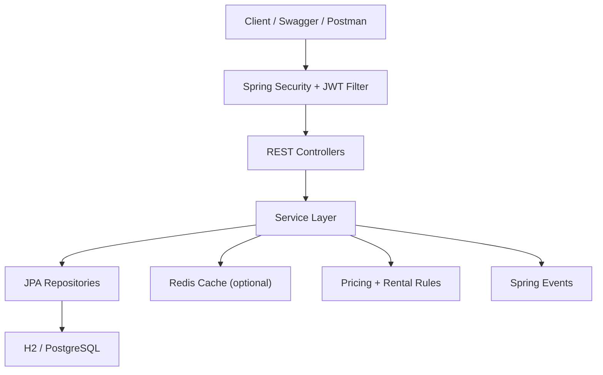
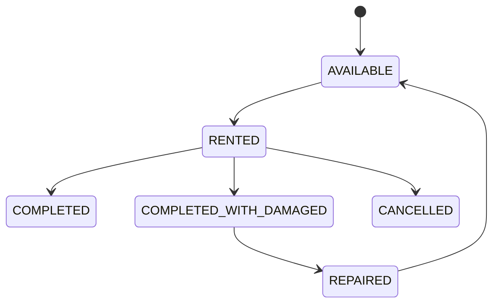

# 🚗 Car Rentals API

Backend service for managing car inventory, customers, authentication, and the full rental lifecycle for a car rental platform.

Built with Java 17, Spring Boot, Spring Security, JPA, Redis caching, Docker, and OpenAPI.

## 🔗 Quick Links

- 🌐 Live Demo: [Car Rentals API](https://car-rentals-z9i2.onrender.com)
- 📘 Swagger UI: [API Documentation](https://car-rentals-z9i2.onrender.com/swagger-ui/index.html)

## ✨ Overview

This project models a real rental workflow instead of just basic CRUD.

- JWT authentication with refresh tokens
- Role-based access for `ADMIN` and `CUSTOMER`
- Car search, pricing, booking, return, cancellation, and repair flows
- Daily and hourly rentals with tax, discount, late-fee, and damage-fee calculations
- Soft delete for cars and customers
- Cache support for available-car listings
- Dockerized local environment with PostgreSQL and Redis
- Swagger UI for API exploration

## 🧩 Core Features

### 🔐 Authentication
- Register and login flows
- JWT access token generation
- Refresh token support
- Stateless Spring Security configuration

### 🚘 Car Management
- Create, update, deactivate, and reactivate cars
- Filter by brand, model, fuel type, seat type, availability, price range, and registration number
- Availability checks for booking workflows

### 📦 Rental Management
- Rent a car as an admin or as the authenticated customer
- Return cars with late-fee and damage-fee handling
- Cancel active rentals
- Track overdue and damaged rentals
- Mark damaged cars as repaired and available again

### 🧠 Business Logic
- Daily and hourly pricing
- Tax calculation
- Duration-based discounts
- Late return penalties
- Damage fee handling
- Event publishing for completed, damaged, and overdue rentals

## 🏗️ Architecture



## 🔄 Rental Lifecycle



## 🛠️ Tech Stack

| Area | Tools |
| --- | --- |
| Language | Java 17 |
| Framework | Spring Boot 3 |
| Security | Spring Security, JWT |
| Persistence | Spring Data JPA, Hibernate |
| Databases | H2, PostgreSQL |
| Cache | Spring Cache, Redis |
| API Docs | springdoc OpenAPI / Swagger UI |
| Build | Maven |
| Containers | Docker, Docker Compose |
| Testing | JUnit 5, Spring Boot Test, Spring Security Test, Testcontainers |

## 📡 API Surface

The project currently exposes about 30 REST endpoints across:

- `AuthController`
- `CarController`
- `RentalController`
- `CustomerController`
- health and home endpoints

### 📚 Main Modules

| Module | What it covers |
| --- | --- |
| Authentication | register, login, refresh token |
| Cars | inventory, filters, pricing range, activation state |
| Rentals | booking, returns, cancellations, overdue and damaged tracking |
| Customers | admin-only customer management |
| Operations | health check, event-driven lifecycle logging |

## 📁 Project Structure

```text
src/
  main/
    java/com/CarRentalSystem/CarRentals/
      Config/
      Controllers/
      DTO/
      Entities/
      Enums/
      Events/
      ExceptionHandler/
      Listeners/
      Repositories/
      Security/
      Services/
    resources/
      application.yaml
  test/
    java/com/CarRentalSystem/CarRentals/
      Controllers/
      integration/
      Listeners/
      Security/
      Services/
```

## ⚙️ Local Setup

### ✅ Prerequisites

- Java 17+
- Maven or the included Maven wrapper
- Docker (only needed for containerized run or Testcontainers-based integration tests)

### 1. Run locally with H2

The app uses in-memory H2 by default, so you can start it without installing PostgreSQL or Redis.

```bash
./mvnw spring-boot:run
```

App URLs:

- API root: `http://localhost:8080/`
- Health: `http://localhost:8080/api/health`
- Swagger UI: `http://localhost:8080/swagger-ui/index.html`

### 2. Run with Docker Compose

This starts the app with PostgreSQL and Redis.

```bash
docker compose up --build
```

### 🧾 Useful Environment Variables

| Variable | Purpose | Default |
| --- | --- | --- |
| `PORT` | application port | `8080` |
| `DB_URL` | datasource URL | H2 in-memory database |
| `DB_USERNAME` | datasource username | `sa` |
| `DB_PASSWORD` | datasource password | empty |
| `DDL_AUTO` | Hibernate schema mode | `update` |
| `CACHE_TYPE` | cache provider | `simple` |
| `REDIS_HOST` | Redis hostname | `localhost` |
| `REDIS_PORT` | Redis port | `6379` |
| `JWT_SECRET` | signing key for JWT tokens | configured via property fallback |
| `JWT_EXPIRATION` | access token TTL in ms | `3600000` |
| `AVAILABLE_CARS_CACHE_TTL` | cache TTL for available cars | `90` |
| `OVERDUE_CHECK_MS` | overdue scan interval | `3600000` |

## 🔑 Example Authentication Flow

### Register

```http
POST /auth/register
```

### Login

```http
POST /auth/login
Content-Type: application/json
```

```json
{
  "customerEmail": "example@gmail.com",
  "password": "Password@123"
}
```

### Response

```json
{
  "accessToken": "jwt-access-token",
  "refreshToken": "refresh-token"
}
```

### Auth Header

```http
Authorization: Bearer <JWT_TOKEN>
```

## 🧪 Testing

Run the automated test suite with:

```bash
./mvnw test
```

Current coverage includes:

- pricing logic tests
- JWT service tests
- custom user-details service tests
- controller security tests
- event listener smoke test
- soft-delete integration tests with Testcontainers

Note: Testcontainers-based integration tests are skipped automatically when Docker is unavailable.

## 🚀 Deployment

- `Dockerfile` uses a multi-stage build
- `docker-compose.yml` runs the app with PostgreSQL and Redis
- AWS deployment notes are available in [docs/aws-ec2-deployment.md](docs/aws-ec2-deployment.md)

## 📸 Screenshots

### Swagger Overview

<p align="center">
  
</p>

### API Listing

<p align="center">
  
</p>

### Login Response

<p align="center">
  
</p>

### Database Overview

<p align="center">
  
</p>

## 🌱 Future Improvements

- add CI pipeline for build, test, and image publish
- add metrics and monitoring
- move secrets fully to environment-specific secret managers
- add notification integrations for overdue or damaged rentals
- expand integration coverage around booking and return workflows

## 👨‍💻 Author

Dayanand  
GitHub: [dayanand0304](https://github.com/dayanand0304)
